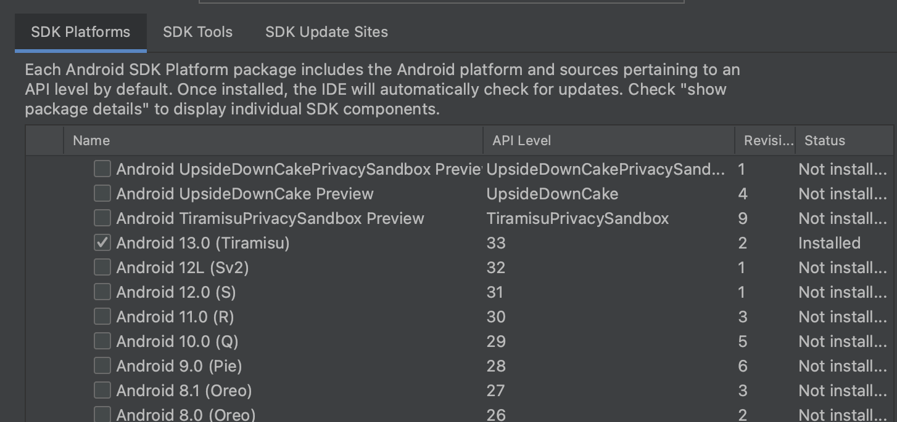
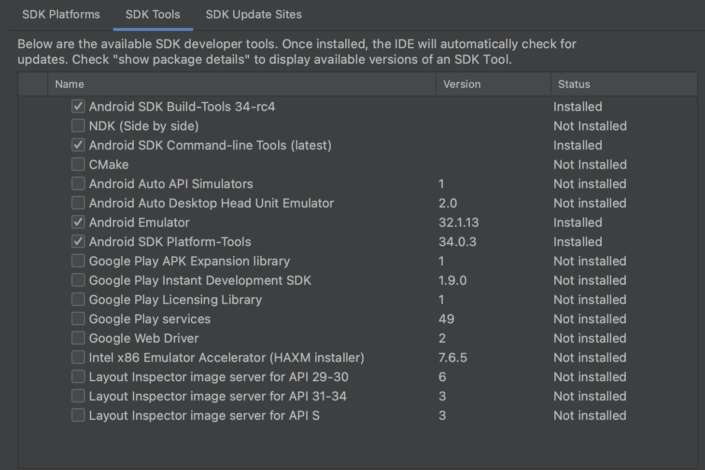

## 1. Flutter 설치

[Flutter 설치 링크](https://docs.flutter.dev/get-started/install/macos#get-sdk)

```bash
sudo softwareupdate --install-rosetta --agree-to-license
```

** 설치 후, 원하는 디렉토리에 이동. **이동시킬때 숨김파일도 남김없이 이동시켜야됨.**

## 2. 환경변수 지정

1. Path 지정
    
    ```bash
    export PATH="$PATH:`pwd`/Users/yohanlee/flutter/bin"
    ```
    
2. zsh기준, 루트 사용자 경로에 `.zshrc` 파일에 아래 코드 기입.
    
    ```bash
    export PATH="$PATH:/Users/yohanlee/tools/flutter/bin"
    ```
    
3. `which flutter` 명령어로 환경변수가 제대로 지정됬는지 확인

## 3. 의존성 패키지 지정

1. 안드로이드 스튜디오(젯브레인), Xcode설치(애플 앱스토어)
2. `cocoapods` 설치(2023.06.04 기준 설치 명령어)
    
    ```bash
    sudo gem install activesupport -v 6.1.7.3
    sudo gem install cocoapods
    ```
    
3. `flutter doctor` → 해당명령어로 플러터를 위한 의존 패키지가 모두 설치됬는지 확인.

### XCode 부가 셋팅

1. 새로 설치한 Xcode를 사용하도록 아래 명령어 실행
    
    ```bash
    sudo xcode-select --switch /Applications/Xcode.app/Contents/Developer
    sudo xcodebuild -runFirstLaunch
    ```
    
2. `open -a Simulator` 명령어로 XCode 시뮬레이터 작동 확인 

### Android Studio 부가 셋팅


SDK Platform 설치 확인



SDK Tools 확인

