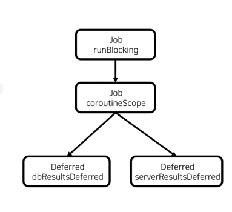

# 일시중단 함수
- suspend fun 키워드로 선언되는 함수로 함수 내에 **일시 중단 지점**을 포함할 수 있는 함수.
- 일시중단 함수는 일시 중단 지점이 포함된 코드를 **재사용할 수 있는 코드의 집합으로 만드는데** 사용한다.
- 일시 중단 지점이 포함될 수 있기 때문에 코루틴에서만 호출 가능.
- 일시중단 함수는 다른 일시중단 함수를 호출할 수 있음.
### 일시 중단 함수는 CoroutineScope에 접근 할 수 없기 때문에 별도 처리 없이 코루틴 빌더 함수를 호출할 수 없음.
```kotlin
suspend fun searchByKeyword(keyword: String): Array<String> {
  val dbResultsDeferred = async { //오류 발생. 일시중단 함수에서 코루틴 빌더 함수를 호출할 수 없음.
    searchFromDB(keyword)
  }
  val serverResultsDeferred = async { //오류 발생. 일시중단 함수에서 코루틴 빌더 함수를 호출할 수 없음.
    searchFromServer(keyword)
  }
  return arrayOf(*dbResultsDeferred.await(), *serverResultsDeferred.await())
}
suspend fun searchFromDB(keyword: String): Array<String> {
  delay(1000L)
  return arrayOf("[DB]${keyword}1", "[DB]${keyword}2")
}

suspend fun searchFromServer(keyword: String): Array<String> {
  delay(1000L)
  return arrayOf("[Server]${keyword}1", "[Server]${keyword}2")
}
```
- 이러한 이슈를 해결하기 위해선 coroutineScope 함수를 사용하여 일시 중단 함수 내부에 새로운 CoroutineScope를 만들어야 함.(Code10-3 참조)
- coroutineScope 함수를 사용하면 구조화를 깨지 않고, 일시 중단 함수 내부에서 코루틴 빌더 함수를 호출할 수 있음.
### Code10-3의 코루틴 상속 구조
  
- **허나 coroutineScope을 사용하면, 특정 코루틴에서 에러가 발생 시, 연관된 코루틴들이 모두 취소가 될 수 있다.**  
- 이문제를 해결할려면 supervisorScope을 사용하면된다~! (Code10-4.kt 참조)
