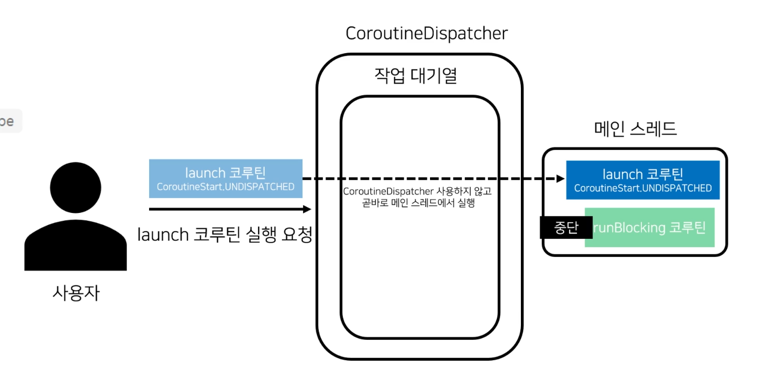

# 공유 상태를 사용하는 코루틴의 문제와 해결책
## 가변 변수를 사용할 때의 문제점
- 스레드 간에 데이터를 전달하거나 공유자원이 있는 경우, 가변 변수를 통해 상태를 공유하고 업데이트해야한다.
- 이런 경우 여러 스레드에서 가변 변수에 동시에 접근할 때, 동시성 이슈가 발생할 수 있다.
## JVM의 메모리 공간이 하드웨어 메모리 구조와 연결되는 방식
- JVM은 스레드마다 스택영역이라 불리는 메모리 공간을 갖고 있고, 이 스택 영역에는 원시 타입의 데이터나 힙 영역에 저장된 객체에 대한 참조가 저장된다.
- 힙 영역은 JVM에 올라간 스레드에서 공통으로 사용되는 메모리 공간으로 객체나 배열같이 복잡한 데이터가 저장된다.
- 컴퓨터는 CPU 레지스터, CPU 캐시 메모리(L1, L2, L3), 메인 메모리 영역으로 구성된다.
- 각 CPU는 CPU 캐시 메모리를 중간에 두고, 메모리 접근 속도를 향상시킨다.
- JVM의 스택 영역과 힙 영역에 저장되는 데이터는 컴퓨터의 메모리 공간중 어디에나 저장될 수 있다.
- 이로 인해 코루틴에서 상태를 공유할 때, **메모리 가시성문제**와 **경쟁 상태문제**가 발생할 수 있따.
### 공유 상태의 메모리 가시성 문제
- 공유 상태의 메모리 가시성 문제란? 하나의 스레드가 다른 스레드가 변경한 상태를 확인하지 못하는 문제.
- CPU 캐시 메모리와 메인메모리는 값이 변경될때 즉시 동기화가 되지 않기 때문에, 메모리 가시성문제가 발생할 수 있다.
- 이 문제를 해결하기 위해 `@volatile`를 사용할 수 있다. (Code12-2.kt 참조)
  - `@volatile`를 사용하면 변수를 업데이트할때마다 메인메모리에 바로 플러시가 되어, 다른 스레드에서도 즉시 확인할 수 있다.
  - **하지만 여러 스레드가 동시에 하나의 값에 접근할 수 있는** 경쟁 상태 문제**가 여전히 발생하여 문제가 해결되지 않는다.**
### 경쟁 상태문제 해결하는방법1 > Mutex객체 사용
- Mutex객체를 사용하면 공유변수영역을 임계 영역으로 만들어 동시 접근을 제한할 수 있다.(Code12-3.kt 참조)
### 코틀린의 ReentrantLock이 아닌 Mutex사용을 권장하는 이유
- ReentrantLock의 lock함수는 스레드를 블로킹한다.
- Mutex는 일시중단함수로 스레드를 블로킹하지 않고, 코루틴을 일시중단함으로써 스레드자체가 블로킹되는것을 막을 수 있다.
## 경쟁 상태문제 해결하는방법2 > 전용 스레드 사용
- 경쟁 상태 문제가 생기는 이유는 복수의 스레드가 공유 상태에 동시에 접근하기 때문이다.
- 따라서 공유 상태 접근 시 싱글스레드를 사용하면 경쟁 상태 문제를 해결할 수 있다. (Code12-4.kt 참조)
## 경쟁 상태문제 해결하는방법3 > 원자성 있는 데이터 구조 사용
- 원자성 있는객체란? 여러 스레드가 동시에 접근하더라도 안전하게 값을 변경하거나 읽을 수 있도록 하는 객체.(AtomicInteger, AtomicReference 등)
- **다만 원자성 있는 객체를 사용하게된다면 연산중에는 스레드자체가 블로킹되므로 주의해아한다.**
- 또한 읽기와 쓰기를 따로 실행한다면 연산이 손실될 수 있다.
# 코루틴 실행 옵션
- 코루틴에 실행 옵션을 주기 위해서는 launch나 async함수의 코루틴 빌더의 start인자로 CoroutineStart옵션을 전달하면 된다.
- 실행옵션 목록
  - CorutineStart.DEFAULT
  - CoroutineStart.ATOMIC
  - CoroutineStart.UNDISPATCHED
  - CoroutineStart.LAZY
## CorutineStart.DEFAULT
- 아무런 값이 전달되지 않는다면 기본 실행 옵션인 CoroutineStart.DEFAULT가 적용된다.
- 코루틴 빌더 함수를 호출한 즉시 코루틴이 생성.
- 코루틴의 실행이 CoroutineDispatcher에 요청된다.
- 코루틴 빌더 함수를 호출한 코루틴은 계속해서 실행됨.

## CoroutineStart.UNDISPATCHED
- CoroutineStart.UNDISPATCHED옵션을 사용하면 코루틴이 실행될 때 CoroutineDispatcher를 거치지 않고 **메인 스레드에서 즉시 실행된다.** (Code12-6.kt 참조)

- CoroutineStart.UNDISPATCHED옵션이 적용되더라도, 일시중단 후 재개될 때는 CoroutineDispatcher를 거쳐서 실행된다.(Code12-6.kt 참조)
---
# 무제한 디스패처
- 무제한 디스패처란? 코루틴을 자신을 실행시킨 스레드에서 즉시 실행하도록 만드는 디스패처.
- 무제한 디스패처를 사용해 실행한 코루틴은 **중단 시점 이후의 재개를 코루틴을 재개 시킨 스레드에서 한다.(Code12-10.kt 참조)
- CoroutineStart.UNDISPATCHED 옵션이 적용된 코루틴은, 재개 시 CoroutineDispatcher에 실행 요청된다.(Code12-11.kt 참조)
---
# 코루틴의 동작 방식과 Continuation
## Continuation Passing Style
- 일반적인 코드가 동작할 때는 작업이 쓰레드를 점유해 코드 라인이 순서대로 동작한다.
- 코루틴은 코드를 실행하는 도중 일시중단하고 필요한 시점에 다시 재개하는 기능을 지원한다.(일시중단시점에 쓰레드가 블록되지 않는다.)
- 코루틴은 어떻게 스레드를 블로킹하지 않고, 일시중단과 재개를 가능하게 할까?
  - 코루틴은 **Continuation Passing Style**이라 불리는 프로그래밍 방식을 통해 실행 정보를 저장하고 전달한다.
  - 코루틴은 일시 중단 시점에 남은 작업 정보가 Continuation객체에 저장된다.
  - 작업의 재개는 Continuation.resumeWith() 함수를 호출할때 발생한다.
  - Continuation.resumeWith() 함수가 호출되면 Continuation객체에 저장된 작업 정보를 통해 남은 작업들이 마저 실행된다.
  - suspendCancellableCoroutine을 통해 Continuation를 직접 다룰 수도 있다. (Code12-12.kt 참조)
  - 물론 Continuation을 직접 다루는것은 권장하지 않으며, 대부분의 상황에서는 코루틴 라이브러리의 고수준 API를 사용해도 충분하기때문에 사용할일 별로 없다.
