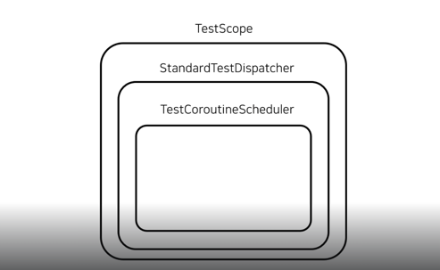

# 코루틴 테스트
## 테스트 더블
- 테스트 더블이란? 객체에 대한 대체물로, 객체의 행동을 모방하는 객체.
- 다른 객체와 의존성을 가진 객체를 테스트하기 위해 테스트 더블이 필요하다.
- 테스트 더블의 종류
  - 스텁(Stub)
  - 페이크(Fake)
  - 목(Mock)
### 스텁(Stub)
- 스텁이란? 미리 정의된 데이터를 반환하는 객체.
- 반환값이 없는 함수 구현하지 않고, **반환 값이 있는 동작만 미리 정의된 데이터를 반환하도록 구현.**
### 페이크(Fake)
- 페이크란? 실제 객체와 비슷하게 동작하도록 구현된 객체.
- 데이터베이스를 의존하는 객체를 테스트할 때, 데이터베이스를 사용하지 않고 가짜 데이터베이스를 사용하게된다.(ex. 인메모리)
## 코루틴 단위 테스트
- 간단한 일시중단 함수를 테스트할땐 테스트 메소드에 runBlocking을 사용하면 된다. (RepeatAddUseCaseTest.kt 참조)
- 허나, runBlocking을 사용하면 오랜시간이 소요되는 일시중단 함수를 테스트를 할때 문제가 발생한다.(RepeatAddUseCaseTest.kt 참조)

## 코루틴 테스트 라이브러리
### TestContainerScheduler를 사용하면 가상 시간에서 테스트를 진행할 수 있는 기능을 제공한다.
- TestContainerScheduler의 advanceTimeBy를 사용하면 가상 시간을 흐르게 만들 수 있다.
- TestContainerScheduler의 currentTime 프로퍼티를 사용하면 현재 가상시간을 체크할 수 있다.
- 가상시간 조절 테스트 코드 참고(TestCoroutineSchedulerTest.kt 참고)
- TestContainerScheduler는 TestDispatcher 객체를 만드는 StandardTestDispatcher 함수와 함께 사용할 수 있다. (TestCoroutineSchedulerTest.kt 참고)
- TestCoroutineDispatcher의 advanceUntilIdle 함수를 호출하면 사용하는 모든 코루틴이 완료된 시점으로 점프한다. (TestCoroutineSchedulerTest.kt 참고)

## StandardTestDispatcher
- StandardTestDispatcher함수는 TestContainerScheduler을 생성하는 부분을 포함한다.
  - StandardTestDispatcher인스턴스화 시, 굳이 TestContainerScheduler을 만들어서 안넘겨도된다.

## TestScope
- TestScope함수를 호출하면 TestDispatcher를 가진 TestScope 객체가 반환된다.
- TestScope은 확장 함수를 통해 advanceUntilIdle, advanceTimeBy를 직접호출 할 수 있다.

## runTest
- runTest함수는 TestScope 객체를 사용해 코루틴을 실행하고, 코루틴 내부에서 일시중단함수가 실행되더라도 가상시간을 자동으로 흐르게해 곧바로 실행완료 될 수 있도록 하는 코루틴 빌더 함수이다.
- **즉 advanceUntilIdle을 호출안해도 시간이 자동으로 흐른다.**
- runTest함수는 runTest함수로 생성된 코루틴 내부에서 실행된 코루틴 시간만 흐르게 만든다.
- runTest함수를 호출해 생성된 TestScope을 사용해 새로운 코루틴이 실행된다면, 이 코루틴은 자동으로 시간이 흐르지 않는다.
- **그래서 advanceUntilIdle을 명시적으로 호출해야함. (TestCoroutineSchedulerTest.kt 참고)**

- runTest 람다식의 수신객체인 TestScope은 backgroundScope을 제공한다.
- backgroundScope은 runTest의 모든 코드가 실행되는 자동으로 취소되고, **이를 통해 테스트가 무한히 실행되는것을 방지할 수 있다.** (InfinityExecuteTest.kt 참고)