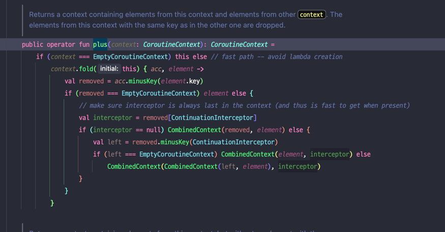
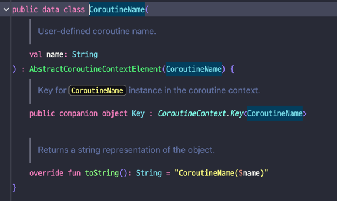
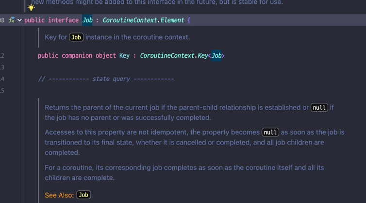

## CoroutineContext의 구성요소
- CoroutineName: 코루틴 이름 지정.
- CoroutineDispatcher: 코루틴을 스레드에 보내는 객체.
- Job: 코루틴을 조작하는데 사용되는 객체.
  - `launch`나 `async` 함수를 사용하면 내부적으로 Job 객체를 생성하여 사용됨.
- CoroutineExceptionHandler: 코루틴에서 예외 처리 객체.
## 코루틴에서 CoroutineContext의 구성요소 관리 방법
- CoroutineContext 객체는 `key-value` 쌍으로 구성요소 관리.
  - 중복된 key는 허용되지 않음.
  - Ex) [코루틴 key - 코루틴 객체], [코루틴 디스페처 key - 코루틴 디스페처]
- 구성요소를 추가하기 위해서는` 더하기 연산자(+)`를 사용하면 됨(Code7-0 참고)
- 아래와 같이 plus 연산자가 오버로딩 되있어서 사용가능함.
- 같은 구성요소가 더해지면 마지막에 추가된 구성요소로 덮어씌워짐.
 

## Job 구성요소 추가
- 기본적으로 `launch` 빌더 함수를 통해 자동 생성하지만, `Job()` 을 호출해 직접 생성가능.

## CoroutineContext의 구성요소
- 구성요소에 접근할려면 **구성요소의 key가 필요.**
- 구성요소의 key는 CoroutineContext.key 인터페이스(`kotlin.coroutines.CoroutineContext.Key`)의 구현체임.
- CoroutineContext의 구성요소들은 보통 자신의 내부에 key객체를 싱글톤 객체로 구현함(아래 이미지 참조)
- CoroutineContext의 구성요소에 접근하기 위해서는 `get()`함수의 인자로 key를 넘기면됨.
- `get()`은 연산자함수로 선언되있어서, 대괄호로 대체가능(`kotlin.coroutines.CoroutineContext.get` 참조)
- 구성요소들은 모두 동반객체(모두 Key 인터페이스를 구현하고 있다는 뜻)로 `.key`를 쓰지 않고도 구성요소로 접근 가능.

## CoroutineContext의 구성요소 제거
- `minusKey()` 함수 인자에 구성요소 키를 넘기면 된다(Code7-3 참고)
