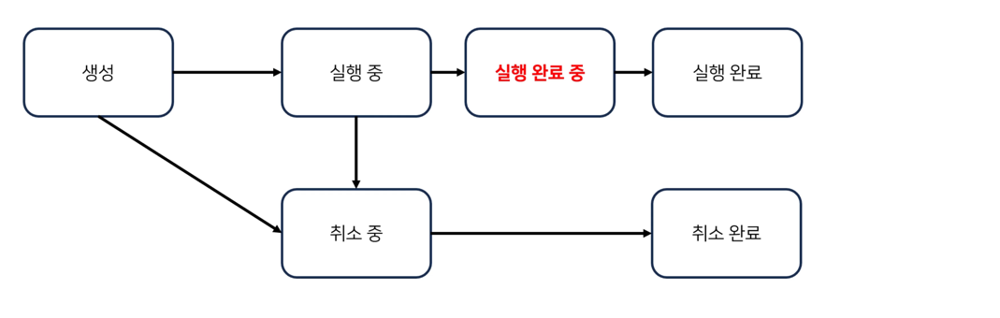
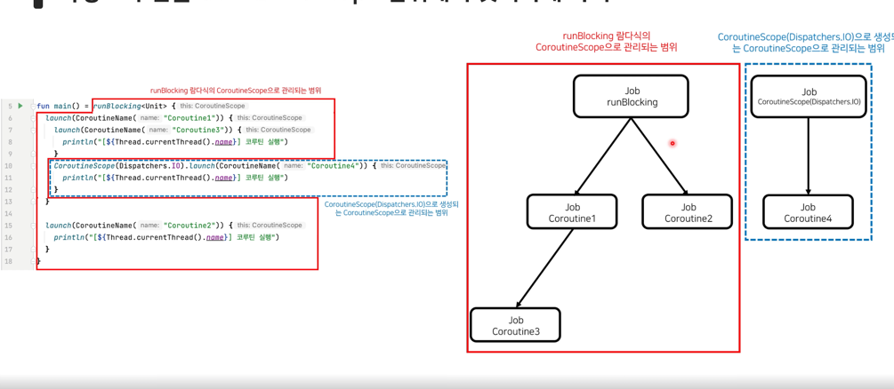

## 구조화된 동시성이란?
- 비동기 작업을 구조화하여, 프로그래밍을 보다 안정적이고 예측가능하게 만드는 원칙.
- 코루틴은 구조화된 동시성의 원칙을 사용하여 코루틴을 부모-자식 관계로 구조화해서 안전하게 관리, 제어함.

## 코루틴 실행환경 상속
- 부모 코루틴은 자식 코루틴에게 본인의 실행환경을 상속 시킴.
- 자식 코루틴을 생성하면 부모의 CoroutineContext이 자식에게 전달됨(Code8-1 참조)
- 다만 자식 코루틴을 생성하는 코루틴 빌더함수에 새로운 CoroutineContext를 전달하면 부모의 CoroutineContext가 무시됨.
## 상속되지 않는 Job
- `launch` 나 `async` 를 포함한 모든 코루틴 빌더 함수는 호출 시 마다 Job객체를 새롭게 생성.
- 각각의 코루틴 제어에 Job객체가 별도로 필요하기 때문에 상속받지 않음.
- 다만 자식 Job객체들은 부모 Job객체를 아예 모르는건 아니고 내부에서 참조하여 들고 있음 -> 구조화된 동시성을 위해..
  - 부모 코루틴은 최대 하나임. 친부모만 존재. 다만 최상위 코루틴은 부모가 없을 수도 있음(https://yeonyeon.tistory.com/334)
- 부모 또한 자식 Job객체를 모르는 것은 아님. Sequence 타입의 children 프로퍼티에 자식 Job객체들을 가지고 있음.
  - 자식은 여러명을 둘 수 있음.
## 코루틴의 구조화
- 코루틴의 구조화는 하나의 큰 비동기 작업을 여러개의 작은 비동기 작업으로 나누어 관리할 때 발생.
- 코루틴에 취소가 요청되면 딸려있는 자식 코루틴에게 **취소가 전파됨** (역전파는 발생 안함)
- 부모 코루틴은 **모든 자식 코루틴이 실행완료해야 완료될 수 있음.**
## 코루틴의 `실행완료중` 상태
- 부모 코루틴의 코드가 모두 실행됬지만, 자식 코루틴이 아직 실행중일 때의 **부모 코루틴의 상태**
- `실행완료중` 상태의 부모코루틴은 자식 코루틴이 모두 완료되면 비로소 `실행 완료` 상태로 바뀜.

## CoroutineScope
- 코루틴 실행환경인 CoroutineContext를 내부적으로 갖고 있는 단순한 인터페이스
- CoroutineScope 생성함수를 사용하여 CoroutineScope객체 생성(Code-8-6 참조)
  - `val coroutineScope = CoroutineScope({코루틴 구성요소(CoroutineContext)})`
-  `launch` 나 `async`함수는 CoroutineScope의 확장함수임.
- CoroutineScope를통해 launch함수를 실행하면
  - launch코루틴은 CoroutineScope의 CoroutineContext를 상속받음. 대신 launch에서 오버라이딩 가능.
  - launch코루틴의 Job은 새로 생성되며, **새로 생성된 Job은 CoroutineScope의 Job을 부모로 가짐(Code-8-7 참조)**
- 모든 하위 `launch`코루틴 이나 `async` 코루틴들도 모두 위와 같은 상속 구조를 갖는다.
## CoroutineScope에 속한 코루틴 범위
- 한 CoroutineScope에 속한 코루틴들은 모두 해당 CoroutineScope의 제어를 받는다.
- 다만 CoroutineScope에 내에서 새로운 CoroutineScope를 생성하면, **새로 생성된 CoroutineScope에 속한 코루틴들은 해당 CoroutineScope의 제어를 받는다.**

## CoroutineScope의 취소
- CoroutineScope를 취소하면 해당 CoroutineScope에 속한 모든 코루틴이 취소됨.
  - 당연히 별도로 생성된 CoroutineScope에 속한 코루틴들은 취소되지 않음.
- `isActive`를 통해 CoroutineScope이 활성화중인지 확인가능.
## 코루틴의 구조화와 Job
- `runBlocking` 함수 호출 시, 최상위 루트 Job이 생성됨.
- 루트 Job이란 부모 Job이 없는 최상위 계층 Job을 의미함.
- 코루틴의 구조화를 깨는 방법
  - `CoroutineScope`를 사용하여 새로운 루트 Job을 생성한다(Code 8-9)
  - `Job`객체를 새로 생성한다(parent 인자 없이) `val job = Job()` (Code 8-10)
- Job 생성 시, parentJob을 인자로 줄 수 있다. parentJob을 안줄 경우, 루트 Job으로 생성됨.
  - `val job = Job()` > 루트 Job으로 생성.
  - `val job = Job(parentJob)` > parentJob의 자식 Job으로 생성.
## runBlocking 함수
- runBlocking 함수를 사용하게된다면 해당 호출부의 스레드를 단독으로 사용하기때문에 지양해야됨.
  - 다만 runBlocking 코루틴의 하위코루틴들은 runBlocking의 스레드를 공유하여 사용할 수 있음.
