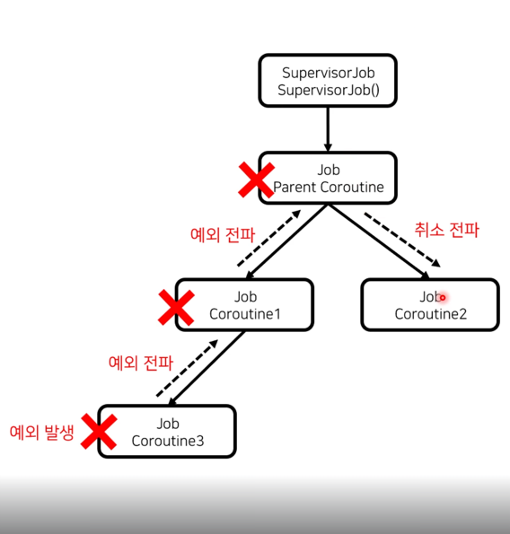

# 예외 전파
- 코루틴 실행 도중 예외가 발생하면, 예외가 발생한 코루틴이 취소되고 예외가 부모코루틴으로 전파됨. 
- 부모코루팀이 특정 자식 코루틴의 예외를 처리하지 않으면, 나머지 자식 코루틴들도 취소된다.
# 예외 전파 제한
- 코루틴의 구조화를 깨면 예외 전파를 제한할 수 있음.
  - 단순히 Job 객체를 새로 만들어 코루틴에 연결하면 구조화가 깨짐.
  - 하지만 구조화를 깨서 예외 전파를 제한하게 된다면, 부모코루틴을 취소 하였을 때, 자식코루틴이 취소되지 않는 사이드이펙트가 발생함.
## 1. SupervisorJob을 사용한 예외 전파 제한
- SupervisorJob? --> 자식 코루틴으로부터 예외를 전파받지 않는 특수한 Job객체.
  - 예외를 전파 받지 않아 자식 코루틴에서 예외를 전파 받더라도 취소되지 않는다.
- 단일 코루틴 빌더 함수의 context인자로 SupervisorJob객체를 넘기고 그 하위에 자식 코루틴들을 생성할 경우, SupervisorJob객체는 아무런 역할을 하지 않음.
  - SupervisorJob객체의 직계자식이 아니기때문에 자식코루틴의 예외를 그대로 전파받아 해당코루틴은 취소된다(아래 그림 참조)
  
### SupervisorScope를 사용한 예외 전파 제한
- supervisorScope? --> SupervisorJob객체를 가진 CoroutineScope 객체를 생성.
- supervisorScope 함수를 통해 생성된 객체는 해당 함수롤 호출한 코루틴을 부모로 가짐.
  - 복잡한 설정 없이 구조화를 깨지 않고, 예외 전파를 제한할 수 있음.
- supervisorScope를 통해 생성된 코루틴은 **명시적으로 complete()함수를 실행하지 않아도, 모든 자식코루틴이 완료되면 자동으로 완료된다.**

## 2. CorutineExceptionHandler를 사용한 예외 처리
- CorutineExceptionHandler는 CoroutineContext의 구성요소중 하나이며, 코루틴에서 발생한 예외를 처리하는 핸들러임.
- CorutineExceptionHandler는 처리되지 않아 전파된 예외만 처리한다.
- CorutineExceptionHandler는 **launch코루틴으로 시작되는 코루틴 계층의 공통 예외 처리기**.
- 만약 launch코루틴이 다른 launch코루틴으로 예외를 전파하면 **예외가 처리된 것으로 보기 때문에** 자식 코루틴에 ExceptionHandler는 동작하지 않음.

## 3. try-catch를 사용한 예외 처리
- 일반적인 try-catch문을 사용하여 예외를 처리할 수도 있음.
- 다만 코루틴 빌더함수에 try catch문을 사용하면 예외를 잡지 못함. (Code9-12.kt 참조)

# async 예외 처리
- async 코루틴 빌더 함수는 코루틴의 결과값을 Deferred 객체로 감싸고, await 호출시점에 결과값을 노출.
- 만약 코루틴 실행 도중에 예외가 발생한다면, Deferred 객체는 await 호출시점에 예외가 전파가된다. (Code9-13.kt 참조)
- async 코루틴 빌더 함수 사용 시, 가장 많이 하는 실수는 await 함수 호출부에서만 예외처리를 하는 것이다.
- async 코루틴 빌더 함수또한 launch 코루틴 빌더 함수와 마찬가지로 예외가 발생하면 부모 코루틴으로 예외가 전파된다.(Code9-14.kt 참조)
  - 그러므로, 예외처리를 await시점에 하면 사이드이펙트가 발생하므로, supervisorScope 사용을 권장한다.

# 전파되지 않는 예외
- CancellationException은 코루틴이 취소될 때 발생하는 예외로, 이 예외는 전파되지 않는다.(Code9-15.kt 참조)
- CancellationException은 코루틴의 취소에 사용되는 특별한 예외이기 때문에 전파되지 않는다.
- JobCancellationException또한 CancellationException을 상속한 예외이기 때문에 전파되지 않는다.(Code9-16.kt 참조)